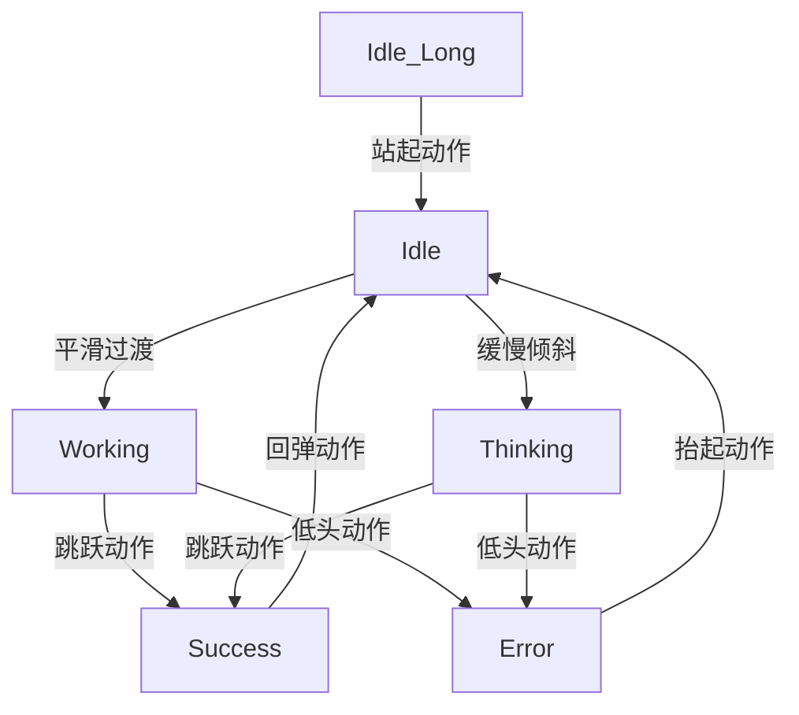

# Claude Code 电子宠物动画状态详细描述

## 动画状态概述

本文档详细描述了小狐狸猫的6个核心动画状态，为 Minimax Image-01 生成提供精确的动画指导。

---

## 1. Idle (待机状态)

### 状态描述
小狐狸猫坐在地上，尾巴轻摆，呈现放松的待机状态，偶尔有小星星闪烁。

### 姿势细节
- **坐姿**: 双腿前伸，前爪自然搭在腿上
- **身体**: 保持直立，重心稳定
- **尾巴**: 从身后自然延伸，轻微摆动

### 动作时序
```mermaid
sequenceDiagram
    participant 0s
    participant 1s
    participant 2s
    participant 3s
    
    0s->>3s: 身体轻微上下浮动（呼吸效果）
    0s->>3s: 尾巴左右轻摆（周期性）
    3s->>3s+: 眨眼动画（120ms）
    1.5s->>1.5s+ 耳朵微动（反应外界）
```

### 特效元素
- **星星特效**: 每3秒在头顶出现1-2颗小星星
  - 颜色: #FFD700（金色）
  - 大小: 3-5px
  - 透明度: 0.8 → 0 → 0.8
  - 持续: 1秒
- **呼吸效果**: 身体轻微上下浮动
- **尾巴摆动**: 左右摆动角度 ±15°

### 表情特征
- **眼睛**: 圆润明亮，偶尔眨眼
- **嘴巴**: 微笑，嘴角上扬
- **耳朵**: 直立，偶尔转动
- **脸颊**: 浅粉色腮红

### 动画参数
- **总时长**: 3秒循环
- **帧数**: 72帧 (24fps)
- **文件大小**: ~300KB
- **循环方式**: 无缝循环

---

## 2. Idle_Long (久等状态)

### 状态描述
小狐狸猫逐渐困倦，从坐姿慢慢趴下，开始打瞌睡，头顶出现Z字气泡。

### 姿势细节
- **坐姿**: 逐渐从直立变为趴卧
- **头部**: 一点一点地下沉
- **身体**: 整体向前倾斜

### 动作时序
```mermaid
sequenceDiagram
    participant 0s
    participant 5s
    participant 10s
    participant 15s
    
    0s->>10s: 身体缓慢前倾
    5s->>15s: 头部点头运动
    8s->>8s+: 眼睛闭合（打瞌睡）
    12s->>12s+: 醒来眨眼
```

### 特效元素
- **Z字气泡**: 头顶漂浮的睡眠指示
  - 颜色: #6495ED（蓝色）
  - 字体: 粗体Arial
  - 动画: Z→z→z
  - 位置: 头顶上方30px
- **呼吸减缓**: 呼吸频率降低50%
- **身体摇晃**: 轻微的前后摇摆

### 表情特征
- **眼睛**: 时闭时开，困倦状态
- **嘴巴**: 微张，呼气状态
- **耳朵**: 下垂，放松状态
- **胡须**: 轻微摆动

### 动画参数
- **总时长**: 6秒循环
- **帧数**: 144帧 (24fps)
- **文件大小**: ~400KB
- **循环方式**: 无缝循环

---

## 3. Working (工作状态)

### 状态描述
小狐狸猫专注工作，前爪在"键盘"上敲击，展现认真工作的态度。

### 姿势细节
- **坐姿**: 保持挺直，专注向前
- **前爪**: 抬起模拟打字动作
- **头部**: 略微前倾，紧盯"屏幕"

### 动作时序
```mermaid
sequenceDiagram
    participant 0s
    participant 0.5s
    participant 1s
    participant 1.5s
    
    0s->>1.5s: 左爪敲击动作
    0.25s->>1.25s: 右爪敲击动作
    0.1s->>0.1s+: 键盘光效
    1s->>1s+: 头部跟随移动
```

### 特效元素
- **敲击光效**: 爪子周围的蓝色光晕
  - 颜色: #00CED1（青色）
  - 大小: 10px 半径
  - 持续: 200ms
  - 频率: 每秒4-6次
- **键盘效果**: 模拟按键反光
- **专注线条**: 眼睛周围的专注光效

### 表情特征
- **眼睛**: 聚焦状态，瞳孔缩小
- **嘴巴**: 紧闭，专注表情
- **眉毛**: 微微皱起，思考状
- **耳朵**: 前倾，注意力集中

### 动画参数
- **总时长**: 2秒循环
- **帧数**: 48帧 (24fps)
- **文件大小**: ~350KB
- **循环方式**: 无缝循环

---

## 4. Thinking (思考状态)

### 状态描述
小狐狸猫托腮思考，歪头好奇，头顶冒出思考泡泡，展现思考过程。

### 姿势细节
- **坐姿**: 身体稍微侧倾
- **头部**: 歪向一边，托腮
- **前爪**: 单爪托住脸颊

### 动作时序
```mermaid
sequenceDiagram
    participant 0s
    participant 2s
    participant 4s
    participant 6s
    
    0s->>6s: 头部轻微晃动
    1s->>1s+: 思考泡泡出现
    3s->>5s: 眼睛转动（思考中）
    5s->>5s+: 耳朵微微竖起
```

### 特效元素
- **思考泡泡**: 头顶漂浮的疑问气泡
  - 颜色: rgba(100, 150, 255, 0.8)
  - 内容: "?" 符号
  - 大小: 12-15px
  - 上升速度: 0.5px/帧
  - 消散时间: 3秒
- **思考线条**: 头周围的流动线条
- **光芒效果**: 思考时的智慧光芒

### 表情特征
- **眼睛**: 睁大，好奇状
- **嘴巴**: O形，思考中
- **眉毛: 轻微上扬，思考表情
- **胡须**: 轻微颤动

### 动画参数
- **总时长**: 4秒循环
- **帧数**: 96帧 (24fps)
- **文件大小**: ~380KB
- **循环方式**: 无缝循环

---

## 5. Success (成功状态)

### 状态描述
小狐狸猫开心跳跃，周围出现星星特效，展现成功后的喜悦。

### 姿势细节
- **跳跃**: 四肢舒展，向上跳跃
- **身体**: 呈现欢乐的跳跃姿态
- **面部**: 开心大笑，笑容灿烂

### 动作时序
```mermaid
sequenceDiagram
    participant 0s
    participant 0.5s
    participant 1s
    participant 1.5s
    
    0s->>0.5s: 起跳动作
    0.25s->>1.25s: 最高点
    0.5s->>1.5s: 下落动作
    0.8s->>0.8s+: 星星特效
```

### 特效元素
- **星星粒子**: 周围闪烁的星星
  - 颜色: #FFD700（金色）
  - 数量: 3-6颗
  - 大小: 4-8px
  - 动画: 旋转 + 上升
  - 持续: 2秒
- **全身发光**: 成功时的光环效果
- **彩虹效果**: 跳跃时的彩虹轨迹

### 表情特征
- **眼睛**: 闭眼笑，弯月形
- **嘴巴**: 大笑，露出牙齿
- **耳朵: 竖起，兴奋状态
- **脸颊**: 深粉色腮红

### 动画参数
- **总时长**: 2秒循环
- **帧数**: 48帧 (24fps)
- **文件大小**: ~420KB
- **循环方式**: 无缝循环

---

## 6. Error (错误状态)

### 状态描述
小狐狸猫难过，眼泪掉落，表现沮丧和失望的情绪。

### 姿势细节
- **低头**: 头部下垂，肩膀塌下
- **身体**: 整体显得萎靡
- **尾巴**: 无力下垂

### 动作时序
```mermaid
sequenceDiagram
    participant 0s
    participant 2s
    participant 4s
    participant 6s
    
    0s->>6s: 头部轻微摇晃
    1s->>1s+: 眼泪掉落
    3s->>5s: 肩膀颤抖
    4s->>4s+: 叹气动作
```

### 特效元素
- **眼泪特效**: 蓝色泪滴掉落
  - 颜色: rgba(100, 150, 255, 0.6)
  - 形状: 水滴形
  - 大小: 3-5px
  - 速度: 1px/帧
  - 持续: 2秒
- **暗淡效果**: 周围光线变暗
- **雨滴效果**: 背景小雨滴

### 表情特征
- **眼睛**: 下垂，悲伤状
- **嘴巴**: 向下撇，难过表情
- **眉毛**: 向下耷拉
- **耳朵**: 下垂，沮丧状态

### 动画参数
- **总时长**: 4秒循环
- **帧数**: 96帧 (24fps)
- **文件大小**: ~370KB
- **循环方式**: 无缝循环

---

## 状态转换设计

### 转换动画


### 转换时间
- **快速转换**: 0.3秒（如Working→Success）
- **中等转换**: 0.5秒（如Idle→Working）
- **缓慢转换**: 1秒（如Error→Idle）

---

## 动画优化建议

### 性能优化
- 使用CSS动画减少文件大小
- 预加载静态资源
- 实现渐进式加载

### 用户体验
- 状态转换自然流畅
- 特效适度不干扰
- 动画速度适中

### 响应式设计
- 适配不同屏幕尺寸
- 保持动画清晰度
- 支持暗色模式

---

*本文档将根据实际开发需求持续完善和优化*