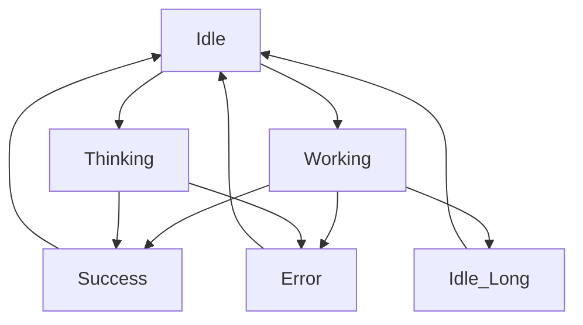

# Claude Code 电子宠物设计规格文档

## 项目概述

本文档为 Claude Code 电子宠物提供完整的设计规格，支持使用 Minimax Image-01 生成高质量的宠物形象和动画状态。

## 宠物基础设计

### 形象定位
- **名称**: 小狐狸猫 (Fox-cat)
- **类型**: 猫耳 + 狐尾的可爱组合
- **风格**: 卡通 Q 版，治愈系
- **目标用户**: 程序员，营造陪伴感

### 核心特征
- **大眼睛**: 圆润可爱，富有表现力
- **毛茸茸尾巴**: 狐狸样式，蓬松自然
- **尖耳朵**: 猫耳特征，灵活转动
- **小爪子**: 精致可爱，动作丰富
- **表情丰富**: 能传达各种情绪状态

### 配色方案
```json
{
  "primary": "#FF8C00",      // 主毛发色：深橙色
  "secondary": "#FFB347",   // 浅橙色：面部、腹部
  "accent": "#FFFFFF",      // 白色：肚皮、脸部高光
  "highlight": "#FFE4B5",   // 米色：耳朵内侧
  "eyes": "#2D2D2D",       // 深色：眼睛主体
  "eyesHighlight": "#FFFFFF", // 白色：眼睛高光
  "nose": "#FF6B6B",       // 粉色：鼻子
  "cheeks": "#FF9999",     // 浅粉色：脸颊
  "mouth": "#8B4513",      // 棕色：嘴巴
  "whiskers": "#4A4A4A",   // 深灰：胡须
  "claws": "#5D4E37",      // 深棕：爪子
  "tail": "#FF8C00"        // 尾巴：与主色一致
}
```

### 形态比例
- **身高**: 160px (站立时)
- **宽度**: 120px (身体最宽处)
- **头部**: 身高的 1/3
- **身体**: 身高的 1/2
- **尾巴**: 身高的 2/3
- **耳朵**: 头高的 1/4
- **眼睛**: 面部的重要焦点

### 材质效果
- **毛发**: 柔和的绒毛质感
- **皮肤**: 光滑但自然
- **眼睛**: 水晶般透明感
- **鼻子**: 湿润反光效果

## 动画状态系统

### 状态分类
1. **Idle (待机)** - 正常状态
2. **Idle_Long (久等)** - 长时间等待
3. **Working (工作)** - 专注工作
4. **Thinking (思考)** - 深度思考
5. **Success (成功)** - 任务完成
6. **Error (错误)** - 出现错误

### 状态转换逻辑


## 技术规格

### 渲染要求
- **分辨率**: 180x180px
- **格式**: PNG with transparent background
- **帧率**: 24fps
- **文件大小**: < 500KB per frame
- **色彩模式**: RGB with alpha

### 动画参数
- **动画时长**: 2-4 seconds per state
- **过渡时间**: 0.5 seconds
- **循环播放**: 所有动画循环播放
- **缓动函数**: ease-in-out

### 性能优化
- **图层分离**: 背景、主体、特效分离
- **缓存机制**: 静态部分预渲染
- **压缩优化**: 使用WebP格式优化

## 输出文件规格

### 主要文件
1. **pet-design-spec.md** - 本设计规格文档
2. **animation-states.md** - 各状态详细动画描述
3. **assets/** - 图片资源目录
4. **animations/** - 动画序列目录

### 资源文件
- **pet-sprite.png** - 完整精灵图
- **pet-idle.gif** - 待机动画
- **pet-working.gif** - 工作动画
- **pet-thinking.gif** - 思考动画
- **pet-success.gif** - 成功动画
- **pet-error.gif** - 错误动画

## 设计验证标准

### 视觉质量
- ✅ 形象符合治愈系Q版风格
- ✅ 配色协调，视觉舒适
- ✅ 细节丰富但不杂乱
- ✅ 表情传达准确

### 动画效果
- ✅ 流畅自然，无卡顿
- ✅ 循环播放无缝衔接
- ✅ 状态转换自然
- ✅ 特效适度不抢戏

### 技术实现
- ✅ 符合渲染规格要求
- ✅ 文件大小控制合理
- ✅ 性能优化到位
- ✅ 兼容性良好

## 版本控制

### 当前版本
- **版本号**: v1.0.0
- **创建日期**: 2026-04-14
- **作者**: Claude Code Pet Team

### 变更记录
- v1.0.0: 初始版本，定义基础设计规格

## 许可证
- **开源协议**: MIT License
- **使用范围**: Claude Code 项目专用

---

*本设计文档将根据项目进展持续更新和完善*